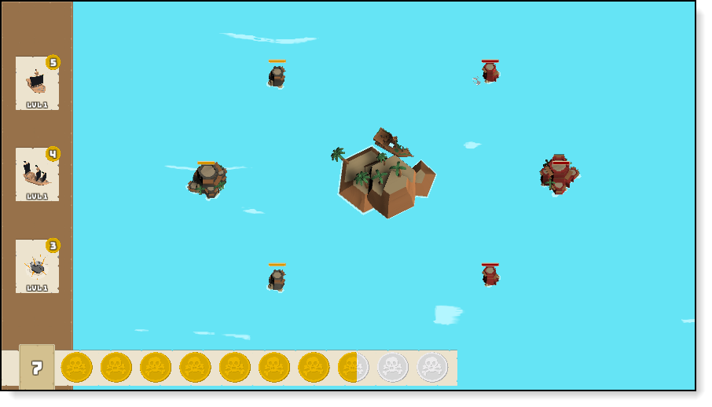
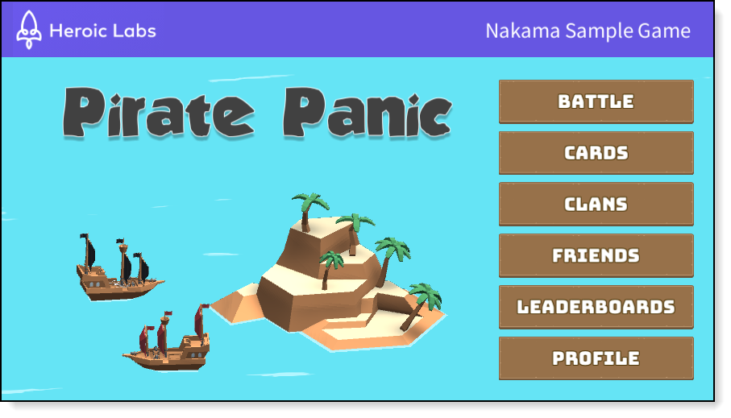
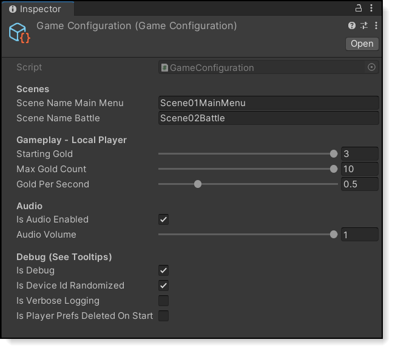

Unity Sample Project
==================



## Welcome to "Pirate Panic" !

This Unity sample project demonstrates the features of the Nakama server by Heroic Labs.

[Nakama](https://github.com/heroiclabs/nakama) is an open-source server designed to power modern games and apps. Features include user accounts, chat, social, matchmaker, realtime multiplayer, and much [more](https://heroiclabs.com).

These docs provide everything you need to download the Unity game, run the Nakama server, and play "Pirate Panic".

## Table Of Contents

- [Nakama Docs](#nakama-docs)
- [Scenes](#scenes)
    + [Examples](#examples)
    + [Pirate Panic Game](#pirate-panic-game-1)
- [Getting Started](#getting-started)
    + [1. Setup Docker](#1-setup-docker)
    + [2. Setup Unity](#2-setup-unity)
    + [3. Play Against Yourself](#3-play-against-yourself)


## Nakama Docs

* **Nakama** (<a target="_blank" href="https://heroiclabs.com/docs/index.html">Docs<a>) - High-level overview
* **Unity Client Guide** (<a target="_blank" href="https://heroiclabs.com/docs/unity-client-guide/">Docs<a>) - Unity setup

## Scenes

#### Pirate Panic Game

The repo includes these scenes for the sample game project.



* **Scene01MainMenu** (<a target="_blank" href="./PiratePanic/Assets/PiratePanic/Scripts/Scene01MainMenuController.cs">Source</a>) - This is the main entry point for the game. **Play this scene first**.
* **Scene02Battle** (<a target="_blank" href="./PiratePanic/Assets/PiratePanic/Scripts/Scene02BattleController.cs">Source</a>) - The core game loop.

## Constants & Configuration

#### Pirate Panic Game

The game centralizes some values which are intended for tweaking and experimentation by game developers.



* **GameConfiguration** (<a target="_blank" href="./PiratePanic/Assets/PiratePanic/Scripts/GameConfiguration.cs">Source</a>) - Stores commonly used values which may be changed at edit-time and runtime.
* **GameConstants** (<a target="_blank" href="./PiratePanic/Assets/PiratePanic/Scripts/GameConstants.cs">Source</a>) - Stores commonly used values which may be changed at edit-time.

## Getting Started

### 1. Setup Docker

The Docker Engine is required. Follow the Heroic Labs <a href="https://heroiclabs.com/docs/install-docker-quickstart/">quickstart guide</a>.

To start the game server and database once Docker is setup navigate to the `.\ServerModules` folder and run:

```
docker-compose up
```

### 2. Setup Unity

The Unity Editor is required. Download it from <a href="https://unity3d.com/get-unity/download">Unity3d.com/get-unity/download</a>.

1. Open the Unity Project of `./PiratePanic/` in Unity Version **2020.3.7f1** or higher.
2. Open the Unity Console Window (Unity → Windows → General → Console). Confirm there are no warnings or errors.
3. By default, the game will attempt to communicate with port 7350 of localhost, which is the default Nakama HTTP port. If you'd like to change your host or IP, you can do so when constructing the client: https://github.com/heroiclabs/unity-sampleproject/blob/master/PiratePanic/Assets/PiratePanic/Scripts/Scene01MainMenuController.cs#L101

### 3. Play Against Yourself

**Standalone Build Play Session**
1. Open the project in the Unity Editor
2. Make a Unity Standalone Build (e.g. WindowsStandalone)
    - Mac OS users will need to temporarily change the bundle identifier prior to building. On Mac OS, Unity shares .plist files between the editor and the standalone build.
3. Run the Standalone Build of Pirate Panic
4. Click "Battle"

**Unity Editor Play Session**
1. Open the project in the Unity Editor
2. Open the scene of `./PiratePanic/Assets/PiratePanic/Scenes/Scene01MainMenu.unity`
3. Run Unity Editor for Pirate Panic
4. Click "Battle"

Now the **Standalone** is playing against the **Unity Editor**. Enjoy!

## Contribute

GitHub issues and pull requests are welcome. If you're interested in enhancing the code please open an issue to discuss the changes or drop in and discuss it in the [community forum](https://forum.heroiclabs.com).

To modify the Typescript remote procedure calls (RPCs), install Node Package Manager (NPM), run `npm install` and `npx tsc` from the `ServerModules` folder, and restart the server.

More documentation on working with the Nakama Typescript runtime can be found here: https://heroiclabs.com/docs/runtime-code-typescript-setup/

### License

This project source code and documentation is licensed under the [Apache-2 License](https://github.com/heroiclabs/unity-sampleproject/blob/master/LICENSE). All images, graphics, and other non-code resources are licensed under [CC BY-NC-ND](https://creativecommons.org/licenses/by-nc-nd/4.0/). Please reach out on a GitHub issue if you have any questions.

All 3rd-party assets and libraries used in this project retain all rights under their respective licenses.